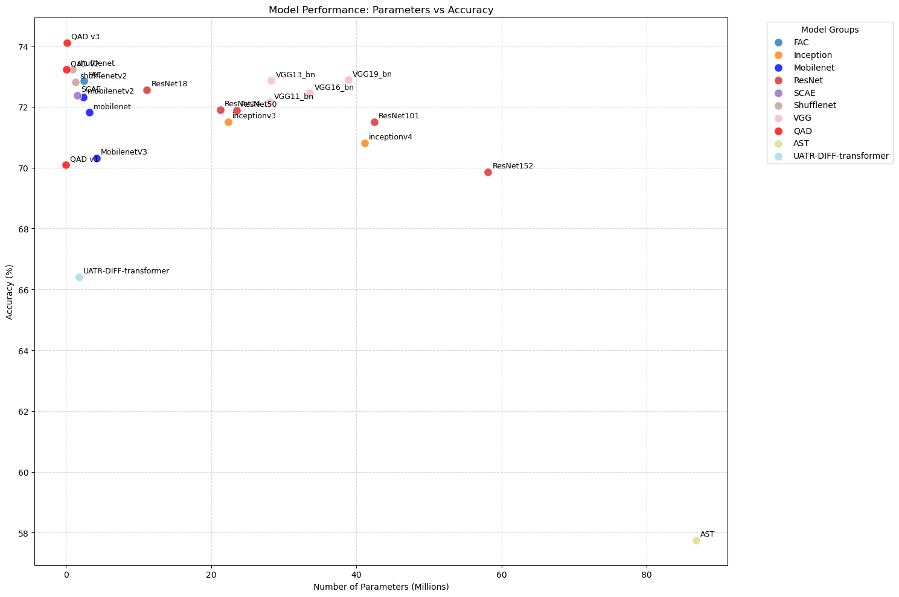

# Quantization Adversarial Distillation for Embedded Underwater Acoustic Target Recognition
QAD, Submitted to **IEEE Embedded Systems Letters(ESL) 2026**

## Introduction
<p align="center">
  
</p>

To address the challenges of resource-constrained UATR sensing platforms, we propose **Quantization Adversarial Distillation (QAD)**, a novel framework that integrates **knowledge distillation (KD)** and **quantization-aware training (QAT)** with **Adversarial Training** to achieve both significant model compression and enhanced recognition performance.

## Performance Benchmarking of CNN-based Models and Transformer
<p align="center">
  
</p>

## Evalutation Summary Across The Metrics
<p align="center">
  
</p>

## Installation
1. Clone this repository and go to QAD folder
```bash
git clone https://github.com/KNU-LMAP/edge-qad.git
cd edge-qad/
```
2. Create a conda environment and install requirements
```bash
conda env create -f environment.yaml
conda activate QAD
```
## Dataset Preprocessing
1. To reproduce the results, ensure your dataset follows the **Directory Structure** below.
```text
DeepShip/
├── Cargo/
│   ├── 1.wav
│   ├── 2.wav
│   └── ...
├── Passengership/
│   ├── 1.wav
│   ├── 2.wav
│   └── ...
├── Tug/
│   ├── 1.wav
│   ├── 2.wav
│   └── ...
└── Tanker/
    ├── 1.wav
    ├── 2.wav
    └── ...
```
2. Go to data/ directory.
3. Run split_data.py. (Ensure you set the raw_data_root and output_root inside the script or via arguments.)
```bash
cd data/
python split_data.py
```

## Train
1. Go to scripts/ directory
```bash
cd ../scripts/
```
2. Open the desired .sh file and set your data_root to the preprocessing output root.
3. Run *.sh
```bash
chmod +x *.sh
./train_qad.sh
./train_kd.sh
./train_qat.sh
./train_ref.sh
./train_ad.sh
```
## Citation
